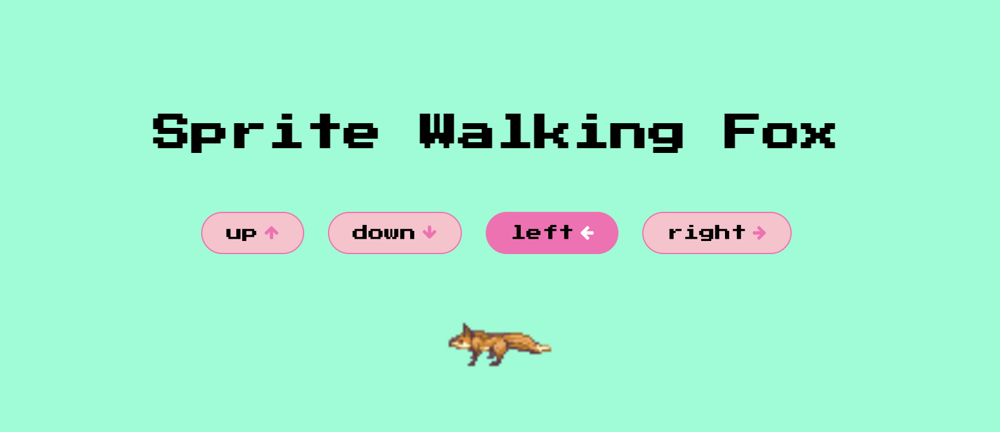

<h2 align="center">
  Sprite Walking Fox Animation 🦊
</h2>
 

  

 

## ✨What are Image Sprites

Image Sprites are a collection of images combined into a single image file. We can display only parts of that single image file, based on what we need

 

## ✨What's the advantage of using Image Sprites?

Image Sprites will reduce the number of server requests since it's loaded only once, instead of having several images being loaded in multiple server requests
